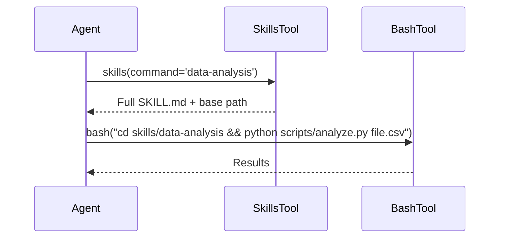
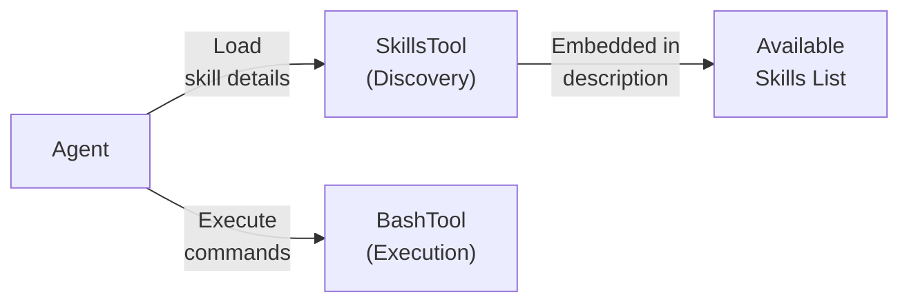

# ADK Skills

Filesystem-based skills with progressive disclosure and two-tool architecture.

---

## Overview

Skills enable agents to specialize in domain expertise without bloating the main context. The **two-tool pattern** separates concerns:

- **SkillsTool** - Loads skill instructions
- **BashTool** - Executes commands
- **Semantic clarity** leads to better LLM reasoning

### Skill Structure

```text
skills/
├── data-analysis/
│   ├── SKILL.md        # Metadata + instructions (YAML frontmatter)
│   └── scripts/
│       └── analyze.py
└── pdf-processing/
    ├── SKILL.md
    └── scripts/
```

**SKILL.md:**

```markdown
---
name: data-analysis
description: Analyze CSV/Excel files
---

# Data Analysis

...instructions...
```

---

## Quick Start

**Two-Tool Pattern (Recommended):**

```python
from kagent.adk.skills import SkillsTool, BashTool, StageArtifactsTool

agent = Agent(
    tools=[
        SkillsTool(skills_directory="./skills"),
        BashTool(skills_directory="./skills"),
        StageArtifactsTool(skills_directory="./skills"),
    ]
)
```

**With Plugin (Multi-Agent Apps):**

```python
from kagent.adk.skills import SkillsPlugin

app = App(root_agent=agent, plugins=[SkillsPlugin(skills_directory="./skills")])
```

**Legacy Single-Tool (Backward Compat):**

```python
from kagent.adk.skills import SkillsShellTool

agent = Agent(tools=[SkillsShellTool(skills_directory="./skills")])
```

---

## How It Works

### Two-Tool Workflow



**Three Phases:**

1. **Discovery** - Agent sees available skills in tool description
2. **Loading** - Invoke skill with `command='skill-name'` → returns full SKILL.md
3. **Execution** - Use BashTool with instructions from SKILL.md

---

## Architecture



| Tool                   | Purpose             | Input                  | Output                    |
| ---------------------- | ------------------- | ---------------------- | ------------------------- |
| **SkillsTool**         | Load skill metadata | `command='skill-name'` | Full SKILL.md + base path |
| **BashTool**           | Execute safely      | Command string         | Script output             |
| **StageArtifactsTool** | Stage uploads       | Artifact names         | File paths in `uploads/`  |

---

## File Handling

User uploads → Artifact → Stage → Execute:

```python
# 1. Stage uploaded file
stage_artifacts(artifact_names=["artifact_123"])

# 2. Use in skill script
bash("cd skills/data-analysis && python scripts/analyze.py uploads/artifact_123")
```

---

## Security

**SkillsTool:**

- ✅ Read-only (no execution)
- ✅ Validates skill existence
- ✅ Caches results

**BashTool:**

- ✅ Whitelisted commands only (`ls`, `cat`, `python`, `pip`, etc.)
- ✅ No destructive ops (`rm`, `mv`, `chmod` blocked)
- ✅ Directory restrictions (no `..`)
- ✅ 30-second timeout
- ✅ Subprocess isolation

---

## Components

| File                      | Purpose                      |
| ------------------------- | ---------------------------- |
| `skills_invoke_tool.py`   | Discovery & loading          |
| `bash_tool.py`            | Command execution            |
| `stage_artifacts_tool.py` | File staging                 |
| `skills_plugin.py`        | Auto-registration (optional) |
| `skills_shell_tool.py`    | Legacy all-in-one            |

---

## Examples

### Example 1: Data Analysis

```python
# Agent loads skill
agent.invoke(tools=[
    SkillsTool(skills_directory="./skills"),
    BashTool(skills_directory="./skills"),
], prompt="Analyze this CSV file")

# Agent flow:
# 1. Calls: skills(command='data-analysis')
# 2. Gets: Full SKILL.md with instructions
# 3. Calls: bash("cd skills/data-analysis && python scripts/analyze.py file.csv")
# 4. Returns: Analysis results
```

### Example 2: Multi-Agent App

```python
# Register skills on all agents
app = App(
    root_agent=agent,
    plugins=[SkillsPlugin(skills_directory="./skills")]
)
```

---

## Comparison with Claude

ADK follows Claude's two-tool pattern exactly:

| Aspect         | Claude              | ADK                    |
| -------------- | ------------------- | ---------------------- |
| Discovery tool | Skills tool         | SkillsTool ✅          |
| Execution tool | Bash tool           | BashTool ✅            |
| Parameter      | `command`           | `command` ✅           |
| Pattern        | Two-tool separation | Two-tool separation ✅ |

---

## What Changed

**Before:** Single `SkillsShellTool` (all-in-one)  
**Now:** Two-tool architecture (discovery + execution)

| Feature                | Before    | After             |
| ---------------------- | --------- | ----------------- |
| Semantic clarity       | Mixed     | Separated ✅      |
| LLM reasoning          | Implicit  | Explicit ✅       |
| Progressive disclosure | Guideline | Enforced ✅       |
| Industry alignment     | Custom    | Claude pattern ✅ |

All previous code still works (backward compatible via `SkillsShellTool`).
